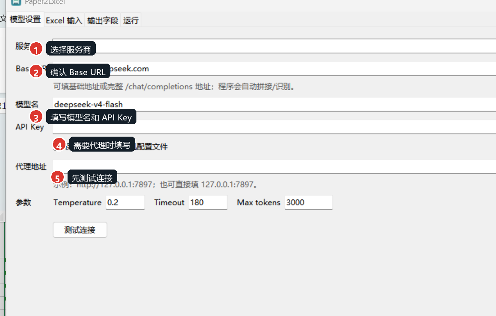
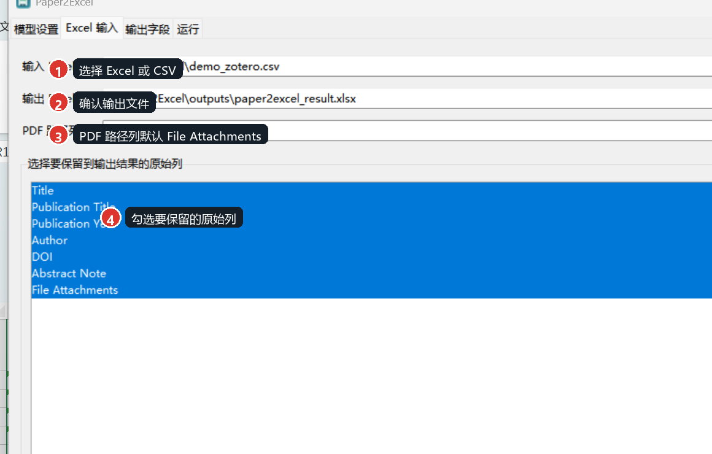
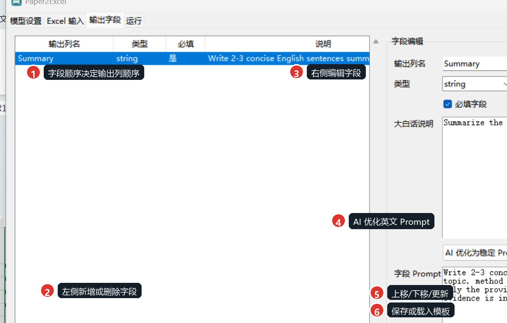
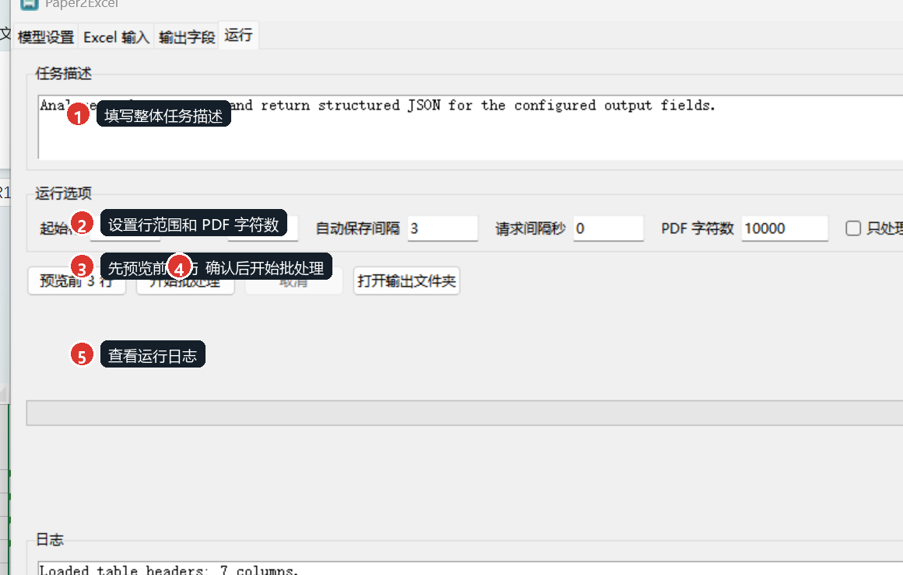

# Paper2Excel

Paper2Excel 是一个 Windows 桌面软件：把 Excel/CSV 中的论文记录逐行交给大模型分析，再把结构化结果写回新的 Excel/CSV。它适合处理 Zotero 导出的文献表、论文清单、PDF 附件路径和自定义综述字段。


## 主要功能

- 读取 `.xlsx` 和 `.csv`。
- 默认保留 Zotero 常见列：`Title`、`Publication Title`、`Publication Year`、`Author`、`DOI`、`Abstract Note`、`File Attachments`。
- `File Attachments` 默认作为 PDF 路径列；输出 `.xlsx` 时会把存在的本地附件路径写成可点击链接。
- AI 分析时默认读取整行信息和 PDF 文本；左侧勾选的列只决定哪些原始列保留到结果中。
- 自定义输出字段，支持 `string`、`number`、`boolean`。
- 输出字段可以上移/下移，字段顺序就是最终结果表中的输出列顺序。
- 可把当前输出字段和任务描述保存为模板，下次直接载入复用。
- 可让 AI 把大白话说明优化成英文 Prompt，适配英文论文。
- 支持 OpenAI-compatible `/chat/completions` 接口，包括 OpenAI、DeepSeek、Kimi、Qwen、GLM、Gemini、OpenRouter、Ollama、LM Studio 等。
- 自动保存进度，失败行会记录 `_status`、`_error`、`_model`、`_processed_at`、`_raw_response`。
- 可打包为 Windows 便携版 EXE，别人下载 Release zip 后解压即可运行。

## 快速使用

从 GitHub Release 下载：

```text
Paper2Excel-v0.1.0-windows.zip
```

解压后双击：

```text
Paper2Excel\Paper2Excel.exe
```

请复制整个 `Paper2Excel` 文件夹，不要只复制单个 EXE。便携版已经包含 Python 运行时和依赖。

## 步骤 1：模型设置

选择服务商，检查 Base URL，填写模型名和 API Key。需要代理时填写 HTTP 代理地址，例如 `http://127.0.0.1:7897`；不需要代理就留空。正式处理前先点“测试连接”。



Base URL 可以填基础地址，例如：

```text
https://api.openai.com/v1
```

也可以填完整接口地址：

```text
https://api.openai.com/v1/chat/completions
```

程序会自动识别并拼接 `/chat/completions`。

常见服务商地址：

| 服务商 | Base URL |
|---|---|
| OpenAI | `https://api.openai.com/v1` |
| DeepSeek | `https://api.deepseek.com` |
| Kimi / Moonshot 国际站 | `https://api.moonshot.ai/v1` |
| Kimi / Moonshot 中国站 | `https://api.moonshot.cn/v1` |
| Qwen / DashScope 中国站 | `https://dashscope.aliyuncs.com/compatible-mode/v1` |
| Qwen / DashScope 国际站 | `https://dashscope-intl.aliyuncs.com/compatible-mode/v1` |
| 智谱 GLM / BigModel | `https://open.bigmodel.cn/api/paas/v4` |
| Gemini OpenAI-compatible | `https://generativelanguage.googleapis.com/v1beta/openai` |
| OpenRouter | `https://openrouter.ai/api/v1` |
| SiliconFlow | `https://api.siliconflow.cn/v1` |
| Groq | `https://api.groq.com/openai/v1` |
| Mistral | `https://api.mistral.ai/v1` |
| xAI / Grok | `https://api.x.ai/v1` |
| Together AI | `https://api.together.xyz/v1` |
| Ollama 本地模型 | `http://localhost:11434/v1` |
| LM Studio 本地模型 | `http://localhost:1234/v1` |
| vLLM 本地模型 | `http://localhost:8000/v1` |

## 步骤 2：选择 Excel/CSV

选择输入表格和输出文件。PDF 路径列默认使用 `File Attachments`。下面的列表用于选择要保留到输出结果中的原始列，不是选择 AI 输入列；AI 会默认读取整行可用信息。



## 步骤 3：设置输出字段

左侧字段列表只负责新增、删除和展示顺序。选中字段后，在右侧编辑列名、类型、必填状态、大白话说明和字段 Prompt。字段顺序可以用“上移 / 下移”调整。



默认只有一个输出字段：

```text
Summary
```

点击“AI 优化为稳定 Prompt”后，程序会让模型把你的中文或英文大白话说明改写成更稳定的英文 Prompt。保存字段模板时，只保存：

- `task_description`
- `output_fields`
- 字段名、类型、必填状态、说明和 Prompt

模板不会保存 API Key、代理、输入文件路径、输出文件路径。

## 步骤 4：预览和批处理

建议先预览前 3 行，确认输出格式和字段内容正常，再开始正式批处理。



输出文件包含：

- 你选择保留的原始列。
- 你自定义的输出字段。
- 诊断列：`_status`、`_error`、`_model`、`_processed_at`、`_raw_response`。

如果输出文件正被 Excel 打开，程序会自动保存为备用文件名。

## API Key 安全

默认不会保存 API Key。只有勾选“保存 API Key 到本机配置文件”时，Key 才会写入本机 `user_config.json`。

公开源码和 Release 时请确认：

- 不提交 `user_config.json`。
- 不提交 `.env`。
- 不提交自己的 Excel、PDF、日志和输出结果。
- `config.example.json` 中 `api_key` 必须为空，`remember_api_key` 必须为 `false`。

本仓库的 `.gitignore` 已排除 `user_config.json`、`release/`、`build/`、`dist/`、`outputs/`、`logs/`、缓存目录等本机文件。

## 从源码运行

创建或使用 Conda 环境：

```powershell
conda env create -f environment.yml
conda activate paper2excel
python main.py
```

如果已经有指定环境，也可以直接运行：

```powershell
& "C:\Path\To\paper2excel\python.exe" ".\main.py"
```

## 打包 Windows Release

在项目根目录运行：

```powershell
powershell -ExecutionPolicy Bypass -File .\build_exe.ps1
```

指定 Python 环境：

```powershell
powershell -ExecutionPolicy Bypass -File .\build_exe.ps1 -Python "C:\Path\To\paper2excel\python.exe" -Version "v0.1.0"
```

脚本会执行：

- 依赖和 SSL 预检查。
- 单元测试。
- PyInstaller 打包。
- EXE 自检。
- Release 内容密钥扫描。
- 生成 `release\Paper2Excel`。
- 生成 `release\Paper2Excel-v0.1.0-windows.zip`。

上传 GitHub Release 时，上传 zip 作为附件即可。源码仓库不要提交 `release/` 目录。

## Git 版本记录

初始化仓库：

```powershell
git init
git add .
git commit -m "feat: initial Paper2Excel release"
git tag v0.1.0
```

发布前检查：

```powershell
git status --short
```

如果输出不为空，先确认是否还有未提交源码变更；不要把本机配置或构建产物加入 Git。

## 项目结构

```text
paper2excel/          核心代码和 GUI
tests/                单元测试
templates/            字段模板
assets/               图标资源
docs/images/          README 截图
build_exe.ps1         Windows 打包脚本
config.example.json   示例配置，不含 API Key
LICENSE               MIT 开源协议
```

## 许可证

本项目使用 MIT License。详见 `LICENSE`。
