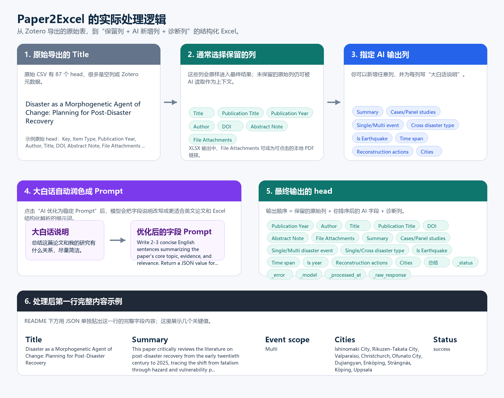

# Paper2Excel

Paper2Excel 是一个 Windows 桌面软件：把 Excel/CSV 中的论文记录逐行交给大模型分析，再把结构化结果写回新的 Excel/CSV。它适合处理 Zotero 导出的文献表、论文清单、PDF 附件路径和自定义综述字段。

[English README](README.en.md)


## 主要功能

- 读取 `.xlsx` 和 `.csv`。
- 默认保留 Zotero 常见列：`Title`、`Publication Title`、`Publication Year`、`Author`、`DOI`、`Abstract Note`、`File Attachments`。
- `File Attachments` 默认作为 PDF 路径列；输出 `.xlsx` 时会把存在的本地附件路径写成可点击链接。
- AI 分析时默认读取整行信息和 PDF 文本；左侧勾选的列只决定哪些原始列保留到结果中。
- 自定义输出字段，支持 `string`、`number`、`boolean`。
- 输出字段可以上移/下移，字段顺序就是最终结果表中的输出列顺序。
- 可把当前输出字段和任务描述保存为模板，下次直接载入复用。
- 可让 AI 把大白话说明优化成英文 Prompt，适配英文论文。
- 支持 OpenAI-compatible `/chat/completions` 接口，包括 OpenAI、DeepSeek、Kimi、Qwen、GLM、Gemini、OpenRouter、Ollama、LM Studio 等。
- 自动保存进度，失败行会记录 `_status`、`_error`、`_model`、`_processed_at`、`_raw_response`。
- 可打包为 Windows 便携版 EXE，别人下载 Release zip 后解压即可运行。

## 处理前后示例

下面的示例来自一个 Zotero 导出的 CSV 和 Paper2Excel 处理后的 XLSX。原始 CSV 有 87 个 head，包含很多空列和 Zotero 元数据列；Paper2Excel 允许你选择通常要保留的论文元数据列，再新增 AI 输出列，最后得到结构化结果表。



这个示例中：

- 原始导出的 `Title` 是 `Disaster as a Morphogenetic Agent of Change: Planning for Post-Disaster Recovery`。
- 通常保留的原始列包括 `Title`、`Publication Title`、`Publication Year`、`Author`、`DOI`、`Abstract Note`、`File Attachments`。
- 用户可以指定 AI 新增输出列，例如 `Summary`、`Cases/Panel studies`、`Single/Multi disaster event`、`Is Earthquake`、`Time span`、`Reconstruction actions`、`Cities`。
- 每个 AI 字段都可以先写大白话说明，再点击“AI 优化为稳定 Prompt”，让模型自动改写成更适合英文论文和 Excel 结构化输出的 Prompt。
- 最终输出 head 的顺序是：保留的原始列 + 你排序后的 AI 字段 + 诊断列。

<details>
<summary>处理后第一行完整内容示例</summary>

```json
{
  "Publication Year": "2026",
  "Author": "Wu, Yanchen; Gu, Kai",
  "Title": "Disaster as a Morphogenetic Agent of Change: Planning for Post-Disaster Recovery",
  "Publication Title": "Journal of Planning Literature",
  "DOI": "10.1177/08854122261422743",
  "Abstract Note": "摘要The field of post-disaster recovery has undergone major epistemological shifts in the past century, with disasters being redefined beyond natural phenomena to expose vulnerabilities within institutional and social systems. Despite planning being recognized as essential for building back better, this ideal remains constrained by incoherent and maladaptive post-disaster spatial intervention. Insufficient theoretical and instrumental grounding for recovery planning is a major problem. The idea of urban morphogenesis describes and prescribes adaptive and fundamental urban changes. Recognizing disaster as a morphogenetic agent of change forms the basis for morpho-resilience—a tactical and place-based planning framework for more coherent post-disaster recovery.在过去的世纪里，灾后恢复领域经历了重大的认识论转变，灾害被重新定义为超越自然现象，以揭示制度和社会系统中的脆弱性。尽管规划被认为是重建更好的关键，但这一理想仍然受到不一致和适应性差的灾后空间干预的限制。恢复规划的理论和工具基础不足是一个主要问题。城市形态发生学描述和规定适应性及根本性的城市变化。将灾害视为形态发生变化的驱动力是形态韧性——一种战术性和基于地点的规划框架，用于更一致的灾后恢复——的基础。",
  "File Attachments": "D:\\Zotero\\storage\\...\\Wu et al._2026_Disaster as a Morphogenetic Agent of Change Planning for Post-Disaster Recovery.pdf",
  "Summary": "This paper critically reviews the literature on post-disaster recovery from the early twentieth century to 2025, tracing the shift from fatalism through hazard and vulnerability paradigms. It identifies that despite the 'build back better' ideal, recovery planning remains constrained by traditional land-use zoning and inadequate responses to structural vulnerabilities embedded in urban landscapes. Drawing on the concept of urban morphogenesis, the paper reinterprets disaster as a morphogenetic agent of change and proposes 'morpho-resilience'—a place-based, tactical planning framework. This framework involves delineating landscape management zones based on morphological analysis, participatory mapping, and integrating form-function-community relationships. It aims to provide a coherent basis for recovery plans that balance continuity and adaptation, address underlying risk, and foster resilient post-disaster urban development.",
  "Cases/Panel studies": "Insufficient evidence",
  "Single/Multi disaster event": "Multi",
  "Single/Cross disaster type": "Cross",
  "Is Earthquake": "No",
  "Time span": "from early twentieth century to 2025",
  "Is year": "Yes",
  "Reconstruction actions": "land use zoning ordinances, building code amendments, risk-based zoning and subdivision regulations, red-zone designation, coastal buffer zone, wildfire management overlay map, street grid replanning, building height restrictions, new materials, structural designs, relocation, shelter reconstruction",
  "Cities": "Ishinomaki City, Rikuzen-Takata City, Valparaíso, Christchurch, Ofunato City, Dujiangyan, Enköping, Strängnäs, Köping, Uppsala",
  "总结": "文章回顾灾后恢复范式的演变，指出传统土地利用规划不足以应对结构性脆弱性。提出将灾害视为形态发生变化的动因，构建形态韧性框架，通过划定景观管理区来实现一致且适应性的恢复规划。",
  "_status": "success",
  "_error": "",
  "_model": "deepseek-v4-pro",
  "_processed_at": "2026-05-27T16:30:25",
  "_raw_response": "[saved in the real output workbook; omitted here because it repeats the JSON values above]"
}
```

</details>

## 快速使用

从 GitHub Release 下载：

```text
Paper2Excel-v0.1.1-windows.zip
```

解压后双击：

```text
Paper2Excel\Paper2Excel.exe
```

请复制整个 `Paper2Excel` 文件夹，不要只复制单个 EXE。便携版已经包含 Python 运行时和依赖。

## 步骤 1：模型设置

选择服务商，检查 Base URL，填写模型名和 API Key。需要代理时填写 HTTP 代理地址，例如 `http://127.0.0.1:7897`；不需要代理就留空。正式处理前先点“测试连接”。


Base URL 可以填基础地址，例如：

```text
https://api.openai.com/v1
```

也可以填完整接口地址：

```text
https://api.openai.com/v1/chat/completions
```

程序会自动识别并拼接 `/chat/completions`。

常见服务商地址：

| 服务商 | Base URL |
|---|---|
| OpenAI | `https://api.openai.com/v1` |
| DeepSeek | `https://api.deepseek.com` |
| Kimi / Moonshot 国际站 | `https://api.moonshot.ai/v1` |
| Kimi / Moonshot 中国站 | `https://api.moonshot.cn/v1` |
| Qwen / DashScope 中国站 | `https://dashscope.aliyuncs.com/compatible-mode/v1` |
| Qwen / DashScope 国际站 | `https://dashscope-intl.aliyuncs.com/compatible-mode/v1` |
| 智谱 GLM / BigModel | `https://open.bigmodel.cn/api/paas/v4` |
| Gemini OpenAI-compatible | `https://generativelanguage.googleapis.com/v1beta/openai` |
| OpenRouter | `https://openrouter.ai/api/v1` |
| SiliconFlow | `https://api.siliconflow.cn/v1` |
| Groq | `https://api.groq.com/openai/v1` |
| Mistral | `https://api.mistral.ai/v1` |
| xAI / Grok | `https://api.x.ai/v1` |
| Together AI | `https://api.together.xyz/v1` |
| Ollama 本地模型 | `http://localhost:11434/v1` |
| LM Studio 本地模型 | `http://localhost:1234/v1` |
| vLLM 本地模型 | `http://localhost:8000/v1` |

## 步骤 2：选择 Excel/CSV

选择输入表格和输出文件。PDF 路径列默认使用 `File Attachments`。下面的列表用于选择要保留到输出结果中的原始列，不是选择 AI 输入列；AI 会默认读取整行可用信息。


## 步骤 3：设置输出字段

左侧字段列表只负责新增、删除和展示顺序。选中字段后，在右侧编辑列名、类型、必填状态、大白话说明和字段 Prompt。字段顺序可以用“上移 / 下移”调整。


默认只有一个输出字段：

```text
Summary
```

点击“AI 优化为稳定 Prompt”后，程序会让模型把你的中文或英文大白话说明改写成更稳定的英文 Prompt。保存字段模板时，只保存：

- `task_description`
- `output_fields`
- 字段名、类型、必填状态、说明和 Prompt

模板不会保存 API Key、代理、输入文件路径、输出文件路径。

## 步骤 4：预览和批处理

建议先预览前 3 行，确认输出格式和字段内容正常，再开始正式批处理。


输出文件包含：

- 你选择保留的原始列。
- 你自定义的输出字段。
- 诊断列：`_status`、`_error`、`_model`、`_processed_at`、`_raw_response`。

如果输出文件正被 Excel 打开，程序会自动保存为备用文件名。

## API Key 安全

默认不会保存 API Key。只有勾选“保存 API Key 到本机配置文件”时，Key 才会写入本机 `user_config.json`。

公开源码和 Release 时请确认：

- 不提交 `user_config.json`。
- 不提交 `.env`。
- 不提交自己的 Excel、PDF、日志和输出结果。
- `config.example.json` 中 `api_key` 必须为空，`remember_api_key` 必须为 `false`。

本仓库的 `.gitignore` 已排除 `user_config.json`、`release/`、`build/`、`dist/`、`outputs/`、`logs/`、缓存目录等本机文件。

## 从源码运行

创建或使用 Conda 环境：

```powershell
conda env create -f environment.yml
conda activate paper2excel
python main.py
```

如果已经有指定环境，也可以直接运行：

```powershell
& "C:\Path\To\paper2excel\python.exe" ".\main.py"
```

## 打包 Windows Release

在项目根目录运行：

```powershell
powershell -ExecutionPolicy Bypass -File .\build_exe.ps1
```

指定 Python 环境：

```powershell
powershell -ExecutionPolicy Bypass -File .\build_exe.ps1 -Python "C:\Path\To\paper2excel\python.exe" -Version "v0.1.1"
```

脚本会执行：

- 依赖和 SSL 预检查。
- 单元测试。
- PyInstaller 打包。
- EXE 自检。
- Release 内容密钥扫描。
- 生成 `release\Paper2Excel`。
- 生成 `release\Paper2Excel-v0.1.1-windows.zip`。

上传 GitHub Release 时，上传 zip 作为附件即可。源码仓库不要提交 `release/` 目录。

## Git 版本记录

初始化仓库：

```powershell
git init
git add .
git commit -m "feat: initial Paper2Excel release"
git tag v0.1.1
```

发布前检查：

```powershell
git status --short
```

如果输出不为空，先确认是否还有未提交源码变更；不要把本机配置或构建产物加入 Git。

## 项目结构

```text
paper2excel/          核心代码和 GUI
tests/                单元测试
templates/            字段模板
assets/               图标资源
docs/images/          README 截图
build_exe.ps1         Windows 打包脚本
config.example.json   示例配置，不含 API Key
README.en.md          英文说明
LICENSE               MIT 开源协议
```

## 许可证

本项目使用 MIT License。详见 `LICENSE`。
